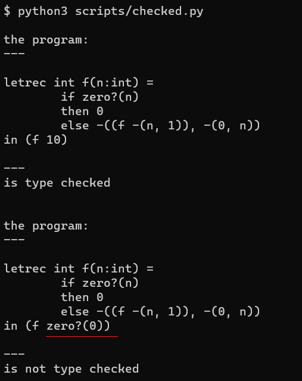

CHECKED: A Type-Checked Language
=================================

代码：:download:`checked.py <scripts/checked.py>`

有类型检查的语言在一定程度上可以减少程序员犯错的几率，让一些简单的错误在编码早期被发现。

类型检查大体上说分为两个流派。

1. 带类型注解
2. 不带类型注解，也叫type inference

java c++ 之类的语言都是带类型注解的。

有 type inference 的语言有 haskell，高版本的c++的auto 语法一定程度上也可以算是type inference。

本篇文章主要讲如何给带类型注解的语言做type check。

首先看语法：proc 表达式的形参增加了类型签名，letrec表达式也是如此。

.. literalinclude:: scripts/checked.py
    :language: python 
    :lines: 2-31
    :emphasize-lines: 23-25,29-31

运行示例程序看看：

针对这种带类型注解的语言，类型检查该怎么做呢，EOPL的办法很直接，直接写一个解释器；
不过这个解释器和我们常见的用来求值的解释器不一样，这个解释器是用来求type的，这其实是在做
抽象解释（abstract interpretation）。

具体实现思路 EOPL里面已经讲的很清楚了，这里只展示python的版本

.. literalinclude:: scripts/checked.py
    :pyobject: type_of

其实就是在写解释器，在type_of求值的时候检查各种表达式提供的约束有没有满足要求，不满足就报类型错误。

