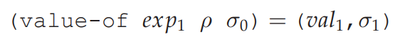

EXPLICIT-REFS: A Language with Explicit References
==================================================

代码：:download:`explicit-ref.py <scripts/explicit-ref.py>`

EXPLICIT-REFS 语言增加了引用类型，并提供了操作引用的几个原语

.. literalinclude:: scripts/explicit-ref.py
    :language: python 
    :lines: 2-38
    :emphasize-lines: 32-38

语言运行效果如下：

按照EOPL的说法，这种带有reference的语言是有effect的，这种语言的解释模式是store-passing style。

可以看到，在给表达式求值需要传入一个store对象，执行完会返回一个新的store对象。
这两个store对象表示的是store的不同状态。

问题：用什么表示store？

答：直接用一个全局的python数组表示，数组的index就是reference。运行期间对store的修改直接映射到
这个数组上即可。

store的表示

.. literalinclude:: scripts/explicit-ref.py
    :language: python 
    :lines: 435-461

求值规则

.. literalinclude:: scripts/explicit-ref.py
    :language: python 
    :lines: 523-536

