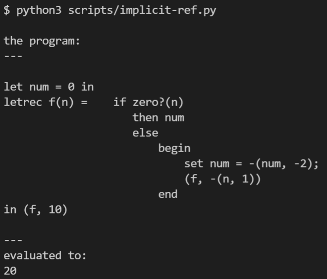
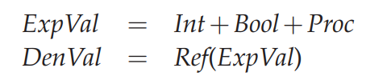
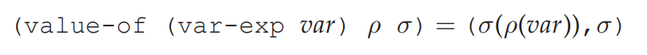

IMPLICIT-REFS: A Language with Explicit References
==================================================

代码：:download:`implicit-ref.py <scripts/implicit-ref.py>`

IMPLICIT-REFS 
隐式 reference 风格的语言有很多，比如我们日常遇到的java，python。

看下语法

.. literalinclude:: scripts/implicit-ref.py
    :language: python 
    :lines: 2-34
    :emphasize-lines: 32-34

语法上只增加了一个 set 表达式

再看下运行效果：

算法很简单，n每减1，num 加2，直到n为0，然后输出num，这是很明显的
implicit reference。

在implicit-refs里面，可以直观地看出 expval和denval的区别

变量现在只能是 reference

针对implicit reference的语言，这里首先问的问题是，我手上有一个变量var，我对其求值需要做
哪些操作？

分2步走：

1. 取得var对应的reference对象
2. 根据reference对象取得其引用的内容

和 variable 有关的表达式有：VarExp，LetExp，CallExp，LetRecExp

.. literalinclude:: scripts/implicit-ref.py
    :language: python 
    :lines: 463-476

LetRec的核心处理在这

.. literalinclude:: scripts/implicit-ref.py
    :pyobject: LetRecEnv 

