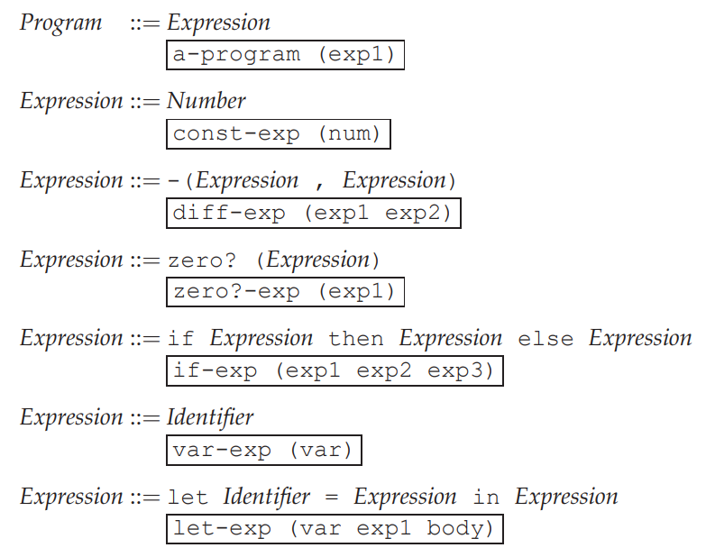
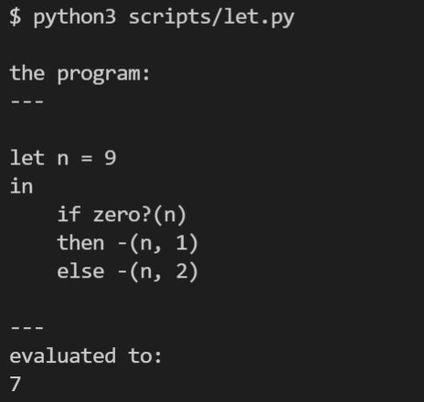

LET: A Simple Language
======================

代码：:download:`let.py <scripts/let.py>`

EOPL 的第三章讲的是一个名为LET的语言，其语法如下：

该语言支持减法，谓词，分支， let 几种表达式, 实现后的语言运行效果如下：

========
词法分析
========

词法分析使用了python正则表达式的named group特性，写起来比较方便。

.. literalinclude:: scripts/let.py
   :linenos:
   :pyobject: tokenize

========
语法分析
========

语法分析的目的是从token流中构造出一颗AST，这里使用的是递归下降算法。

.. literalinclude:: scripts/let.py
   :linenos:
   :pyobject: Parser

======
解释器
======

解释器的核心算法就是在AST上做后向遍历

.. literalinclude:: scripts/let.py
   :linenos:
   :pyobject: evaluate

.. note::

值得注意的是EOPL中将值分成了ExpVal和DenVal，在LET language中:

ExpVal = Int+Bool

DenVal = Int+Bool

这里的设计是很有意思的，比如为什么要专门定义ExpVal，我直接从evaluate里面返回python的int值，
bool值不更方便吗？

如果这样做就混淆了元语言（mete language，这里指python）
和目标语言（object language 这里指LET）的值（value）了，在LET语言里面这种混淆看起来问题不大，
等后面加入了更多的语言特性之后你会发现不做区分不行。

明显这两个东西都是sumtype，在python里面就用继承来表达

.. literalinclude:: scripts/let.py
    :language: python 
    :linenos:
    :lines: 233-257

====
感受
====

纸上得来终觉浅，绝知此事要躬行。

