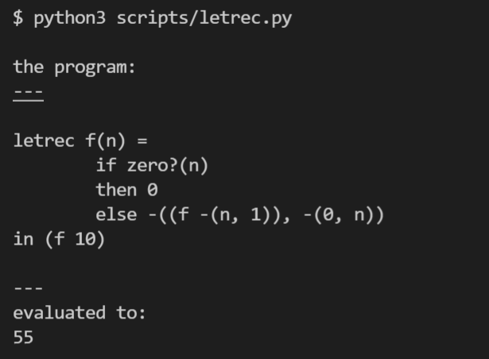

LETREC: A Language with Recursive Procedures
=============================================

代码：:download:`letrec.py <scripts/letrec.py>`

LETREC 语言增加了递归函数，语法如下：

.. literalinclude:: scripts/letrec.py
    :language: python 
    :lines: 2-31
    :emphasize-lines: 30-31

该语言的运行效果如下

evaluate letrec表达式的时候

.. literalinclude:: scripts/letrec.py
    :language: python 
    :linenos:
    :lines: 395-396

重点在LetRecEnv，根据letrec的语义，如果apply的这个递归函数的name，那么就构造一个
procedure给它，否则用往老的env里面查。相关逻辑如下：

.. literalinclude:: scripts/letrec.py
   :linenos:
   :pyobject: LetRecEnv

核心代码其实就在apply这个函数里面