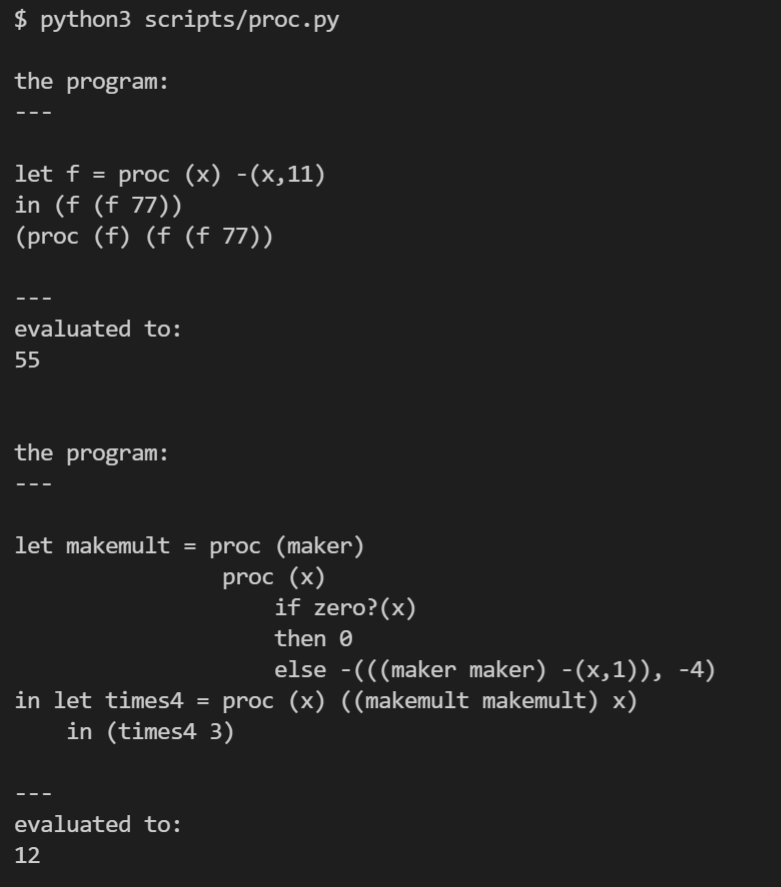

PROC: A Language with Procedures
================================

代码：:download:`proc.py <scripts/proc.py>`

PROC 语言增加了函数定义和函数调用两个表达式，语法如下：

.. literalinclude:: scripts/proc.py
    :language: python 
    :lines: 2-28
    :emphasize-lines: 24-28

值的类型增加了Proc，注意这个东西是first class的

ExpVal = Int+Bool+Proc

DenVal = Int+Bool+Proc

该语言的运行效果如下

mekemult 这部分代码是典型的利用Y combinator 在没有递归语法特性支持的语言
里面实现递归，这是 first class function 厉害的地方。

proc expression 在evaluate的时候会返回一个procedure对象，也就是闭包，
闭包是自带干粮（env）的，调用procedure的时候用的env是闭包自己的env。这里给用 Procedure 类来表示
procedure。

.. literalinclude:: scripts/proc.py
   :linenos:
   :pyobject: Procedure

ExpVal可以是procedure，这里给它增加一个variant

.. literalinclude:: scripts/proc.py
   :linenos:
   :pyobject: ProcVal

parser 增加一些处理逻辑

.. literalinclude:: scripts/proc.py
    :language: python 
    :linenos:
    :lines: 228-241

evaluate的规则也很简单，ProcExp 不必说，evaluate CallExp 的时候使用的env是procedure的env再扩展形参后的env

.. literalinclude:: scripts/proc.py
    :language: python 
    :linenos:
    :lines: 345-353

